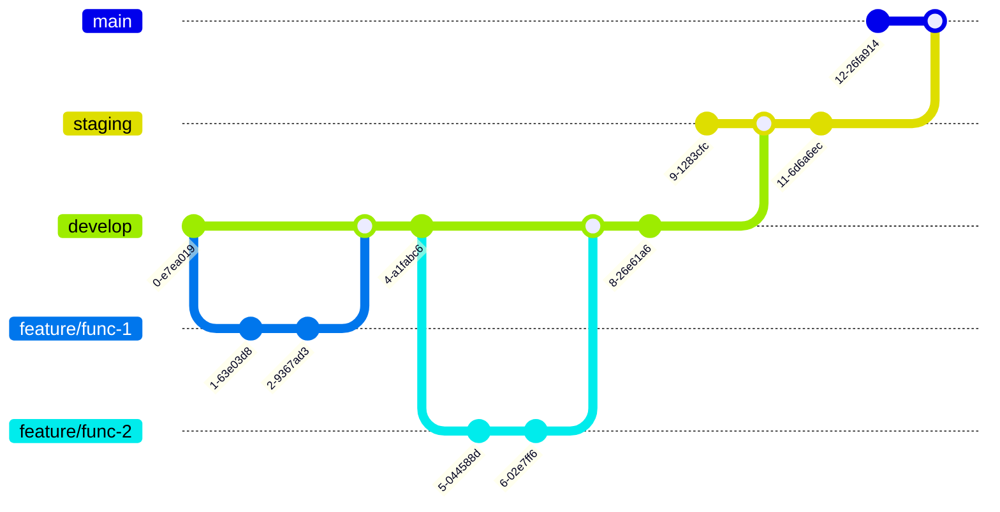

# 📊 SNSフォロワー数表示アプリ

複数のSNSプラットフォーム（Qiita、X/Twitter、Instagram、Facebook）のフォロワー数やいいね数をリアルタイムで表示するデスクトップアプリケーションです。Raspberry Piでの使用を想定していますが、通常のPCでも動作します。

---

## 🚀 特徴

- **マルチプラットフォーム対応**: Qiita、X（Twitter）、Instagram、Facebook のメトリクス表示
- **リアルタイム更新**: 各SNSのデータを定期的に自動更新
- **フルスクリーンUI**: PyQt5による見やすい全画面表示
- **前日比較機能**: フォロワー数の増減を可視化
- **音声通知**: フォロワー増加時の効果音再生
- **ロギング機能**: 詳細なログ記録による問題の追跡
- **Raspberry Pi対応**: キオスク型ディスプレイとしての使用に最適

---

## 🧱 ディレクトリ構成

```
follower-counter/
├── src/                    # ソースコード
│   ├── main.py            # アプリケーションエントリーポイント
│   ├── api/               # API統合モジュール
│   │   ├── qiita.py       # Qiita API（いいね数取得）
│   │   ├── x.py           # X API（フォロワー数取得）
│   │   ├── instagram.py   # Instagram API
│   │   └── facebook.py    # Facebook API
│   ├── ui/                # ユーザーインターフェース
│   │   └── window.py      # PyQt5メインウィンドウ
│   └── utils/             # ユーティリティ
│       ├── config.py      # 環境変数管理
│       ├── logger.py      # ロギング設定
│       └── sound.py       # 音声再生機能
├── settings/              # 設定ファイル
│   └── settings.json      # アプリケーション設定
├── data/                  # データ保存（自動生成）
├── logs/                  # ログファイル（自動生成）
├── asset/                 # SNSアイコン画像（Git管理対象外）
├── .env                   # 環境変数（Git管理対象外）
├── requirements.txt       # 依存パッケージ
└── README.md             # このファイル
```

---

## 📋 必要な環境

- Python 3.8以上
- Raspberry Pi（推奨）またはPC
- インターネット接続
- 各SNSのAPIトークン

---

## 📦 セットアップ手順

### 1. リポジトリのクローン

```bash
git clone https://github.com/SystermDevelopment/follower-counter.git
cd follower-counter/follower-counter
```

### 2. 依存パッケージのインストール

```bash
pip install -r requirements.txt
```

主な必要パッケージ：
- PyQt5（GUI表示）
- requests（API通信）
- selenium（Qiitaデータ取得）
- python-dotenv（環境変数管理）
- pygame（音声再生）

### 3. ChromeDriverのインストール（Qiita用）

```bash
# Raspberry Pi / Debian系の場合
sudo apt update
sudo apt install chromium-chromedriver

# 確認
which chromedriver
```

### 4. 環境変数の設定

プロジェクトルートに`.env`ファイルを作成し、以下の内容を記入してください：

```env
# Qiita
QIITA_TOKEN=your_qiita_bearer_token_here
ORGANIZATION_NAME=your_qiita_organization_name

# X (Twitter)
X_TOKEN=your_x_bearer_token_here
X_ACCOUNT=your_x_username

# Instagram
IG_TOKEN=your_instagram_access_token_here
IG_USER_ID=your_instagram_business_account_id

# Facebook
FB_TOKEN=your_facebook_access_token_here
FB_PAGE_ID=your_facebook_page_id
```

### 5. APIトークンの取得方法

#### Qiita
1. https://qiita.com/settings/tokens にアクセス
2. 「新しくトークンを発行する」をクリック
3. 「read_qiita」権限を選択
4. 発行されたトークンを`QIITA_TOKEN`に設定

#### X (Twitter)
1. https://developer.twitter.com/ で開発者アカウントを作成
2. Appを作成
3. Bearer Tokenを生成
4. `X_TOKEN`に設定

#### Instagram & Facebook
1. https://developers.facebook.com/ でアプリを作成
2. Instagram Basic Display APIまたはInstagram Graph APIを有効化
3. アクセストークンを生成
4. 各トークンを設定

### 6. アイコン画像の配置

`asset/`ディレクトリを作成し、以下のファイル名で画像を配置してください：
- `instagram.png`
- `qiita.png`
- `x.png`
- `facebook.png`

※各サービスの利用規約を確認の上、適切な画像を配置してください

---

## ▶️ 実行方法

```bash
# 仮想環境を有効化
source venv/bin/activate  # Linux/Mac
# または
venv\Scripts\activate     # Windows

# アプリケーションを起動
cd src
python main.py
```

アプリケーションが起動すると：
- フルスクリーンでSNSメトリクスが表示されます
- 各SNSのデータが定期的に自動更新されます
- ESCキーでフルスクリーン⇔ウィンドウモードを切り替えできます

---

## ⚙️ 設定のカスタマイズ

### settings/settings.json
アプリケーションの動作を調整できます：

```json
{
    "compare_days_ago": 7,              // 比較する日数
    "daily_json": "./data/daily_followers.json",  // データ保存先
    "sound_volume": 50,                 // 音量（0-100）
    "logging": {
        "console_level": "INFO",        // コンソールログレベル
        "file_level": "DEBUG",          // ファイルログレベル
        "enabled": true                 // ログ機能のON/OFF
    }
}
```

#### ログレベル
- `DEBUG`: 詳細情報（開発時）
- `INFO`: 一般情報（通常使用）
- `WARNING`: 警告のみ
- `ERROR`: エラーのみ
- `NONE`: ログなし（コンソールのみ）

---

## ⏰ 更新スケジュール

- **Instagram**: 毎時0分に更新
- **Qiita**: 毎時15分に更新
- **X(Twitter)**: 午前9時30分に更新（1日1回）
- **Facebook**: 毎時45分に更新

---

## 🛠️ トラブルシューティング

### Q: アプリが起動しない
A: 以下を確認してください：
- Pythonのバージョン（3.8以上）
- PyQt5がインストールされているか
- `.env`ファイルが正しく配置されているか

### Q: APIエラーが発生する
A: 以下を確認してください：
- APIトークンが正しく設定されているか
- トークンの有効期限が切れていないか
- API制限に達していないか

### Q: Qiitaのデータが取得できない
A: ChromeDriverが正しくインストールされているか確認してください：
```bash
chromedriver --version
```

### Q: ログファイルを確認したい
A: `logs/`ディレクトリ内に以下のファイルが生成されます：
- `app.log`: メインアプリケーション
- `window.log`: UI関連
- `qiita.log`: Qiita API
- `x.log`: X API
- `instagram.log`: Instagram API
- `facebook.log`: Facebook API

---

## 📊 データの保存場所

- `data/daily_followers.json`: 日別のフォロワー数記録
- `logs/`: ログファイル（7日間保持）

---

## ⚠️ 注意事項

- APIの利用制限に注意してください
- トークンは絶対に公開しないでください
- `.env`ファイルはGitにコミットされません（.gitignoreで除外）
- アイコン画像は著作権やブランドガイドラインを確認の上、適切に配置してください

---

## 🌿 Gitのブランチ運用規約

| branch        | description                                                                 |
|---------------|-----------------------------------------------------------------------------|
| 🚀 `main`        | **納品** まで行った統一ブランチ（最終成果物）                                 |
| 🧪 `staging`     | **検証** 用の統一ブランチ（本番前の確認用）                                   |
| 🛠 `develop`     | **開発** 用の統一ブランチ（すべての作業のベース）                              |
| ✨ `feature/***` | 機能ごとに分けて作業する開発ブランチ（`***`には機能名を明記）                   |
| 📦 `release/***` | リリース時のタグ付け用ブランチ（`git tag`を使用してもOK）                      |
| 🐞 `fix/***`     | バグ対応やIssue修正用ブランチ（`***`には **Issue番号を必ず明記**）             |

---

### 🧭 ブランチの流れ（開発→検証→納品）



---

この運用ルールに従って、ブランチ名と目的を明確にしながら開発・管理を行ってください。
